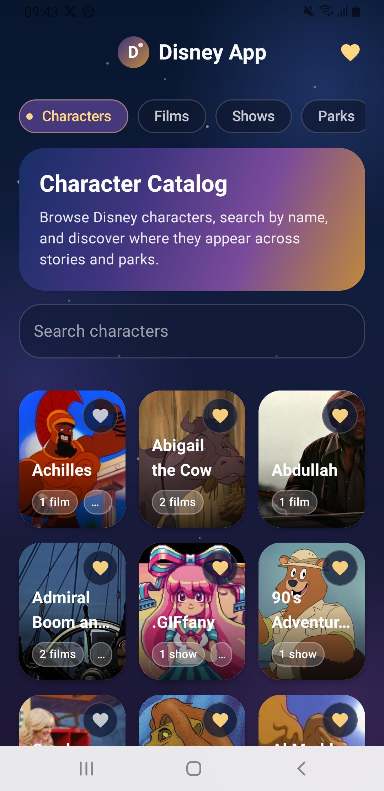
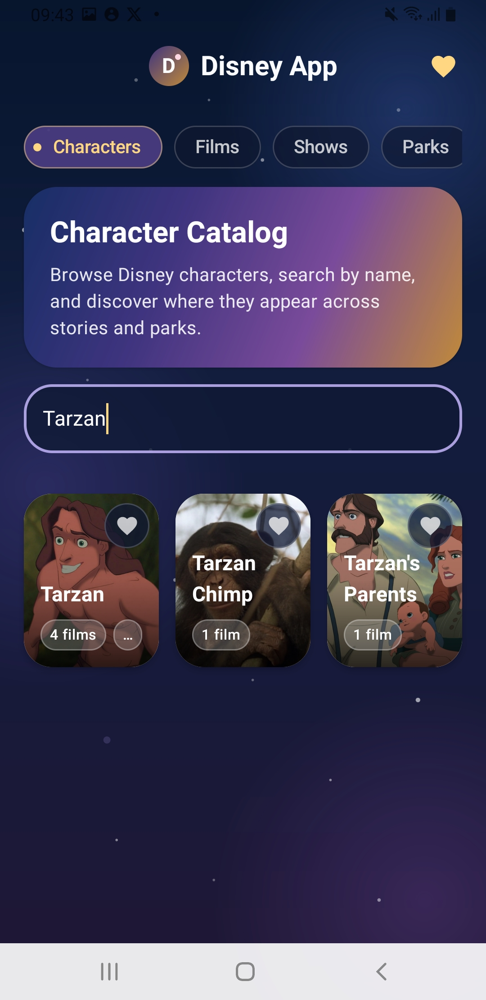
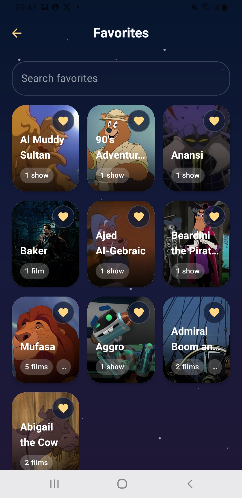
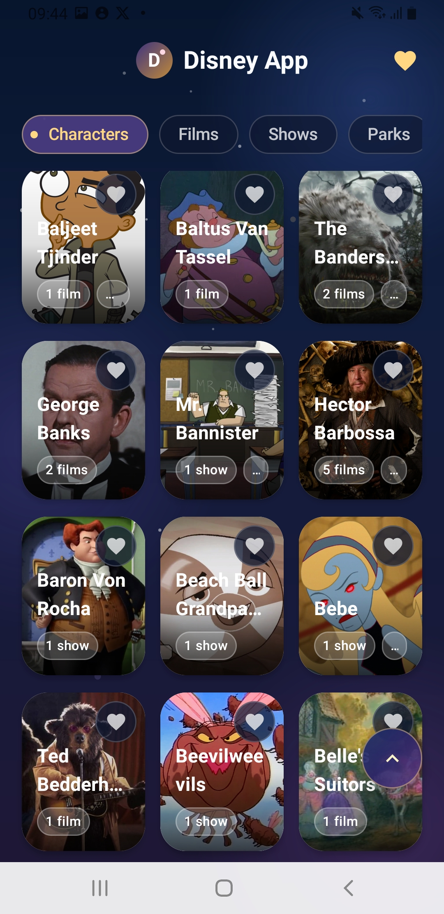
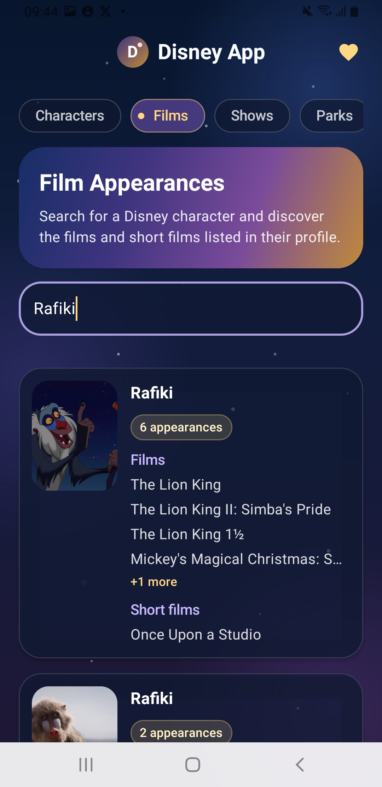
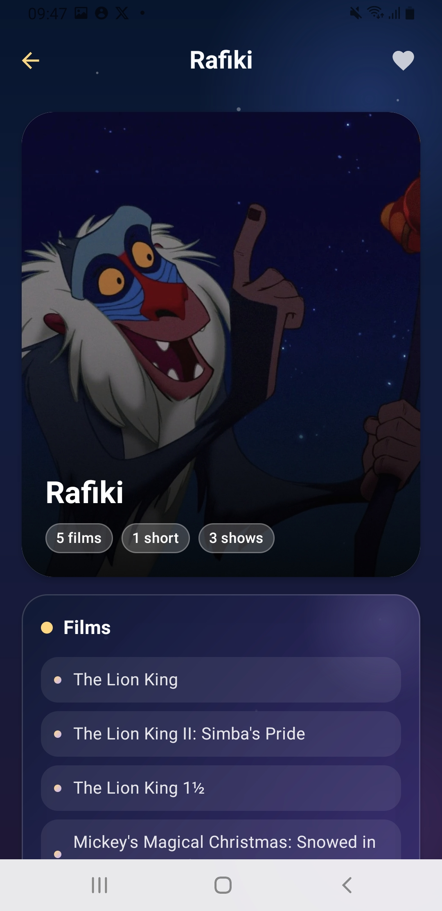

# DisneyApp

Native Android Disney character browser app built with Kotlin, Jetpack Compose, Clean Architecture, MVI, and modern Android best practices.

## Description

DisneyApp is a native Android portfolio app for exploring Disney catalog content through the public Disney API. The app focuses on browsing characters, searching by name, viewing character details, saving local favorites, and presenting the experience with a polished Disney-inspired visual style.

## Project Goal

The goal of this project is to practice and showcase modern Android development with a clean, maintainable architecture, reactive UI state, local persistence, safe remote data handling, and a premium Jetpack Compose interface.

## Main Features

- Browse Disney characters from the public Disney API.
- Search characters by name.
- Open character detail screens with catalog information.
- Save and remove favorite characters locally.
- Browse saved favorite characters.
- Explore film and short film appearances by character.
- Handle loading, empty, and error states.
- Show safe placeholders or fallbacks for missing images.
- Use lightweight local caching for previously loaded character data when remote loading fails.

## Tech Stack

- Kotlin
- Jetpack Compose
- Material 3
- Navigation 3
- Ktor Client
- Koin
- Room
- Coil
- Coroutines
- Flow, StateFlow, and SharedFlow
- JUnit 5, Turbine, MockK, AssertK, and Coroutines Test

## Architecture

DisneyApp follows Clean Architecture, MVI, and unidirectional data flow inside a single `:app` module. The codebase is organized by feature packages while keeping clear boundaries between domain, data, and presentation layers.

Screen state is exposed with `StateFlow`, user interactions are modeled as actions, and one-time UI events are handled through event flows where needed. Domain models are kept separate from remote DTOs and Room entities, with explicit mappers between layers.

## Screenshots

| Character Catalog | Character Search | Favorites |
| --- | --- | --- |
|  |  |  |

| Character List | Film Appearances | Character Detail |
| --- | --- | --- |
|  |  |  |

## How to Run

1. Clone the repository.
2. Open the project in Android Studio.
3. Sync Gradle.
4. Run the app on an Android emulator or physical device.

You can also build the debug APK from the terminal:

```bash
./gradlew :app:assembleDebug
```

## Project Structure

```text
app/src/main/java/com/example/disneyapp
├── core          # Shared data, domain, coroutine, network, and UI helpers
├── di            # Koin dependency injection modules
├── feature       # Feature-based app areas
│   ├── catalog   # Catalog section UI
│   ├── characters
│   └── films
└── ui/theme      # Material theme, colors, typography, and shared brushes
```

## Technical Decisions

- The project stays single-module to keep the portfolio scope focused and reviewable.
- Ktor handles remote API communication with safe error mapping.
- Room persists favorite characters and supports lightweight cached fallback data.
- Koin provides dependency injection for data sources, repositories, use cases, and ViewModels.
- Coil loads remote character images with fallback UI for missing content.
- Shared theme tokens and brushes keep the Disney-inspired visual language consistent across screens.

## Testing

The project includes unit and instrumentation tests around important behavior, including:

- Result and typed error handling.
- DTO, entity, and domain mappers.
- Ktor remote data source behavior.
- Repository fallback and persistence behavior.
- Character and favorite use cases.
- Character list, detail, favorites, and films ViewModels.
- Room DAO tests for cached and favorite character data.

Run the test suite with:

```bash
./gradlew test
```

Run connected Android tests with:

```bash
./gradlew connectedAndroidTest
```

## Project Status

The project is in active development as a focused Android portfolio app. The current scope includes characters, search, character details, local favorites, film appearances, local persistence, lightweight caching, and core test coverage.

## Next Improvements

- Add short demo media to the README.
- Expand focused catalog sections such as Shows, Parks, and attractions.
- Continue improving UI polish and accessibility.
- Increase test coverage around new catalog sections.
- Keep refining cached fallback behavior without turning the app into a complex offline-first system.

## Author

Ruben Yebran
